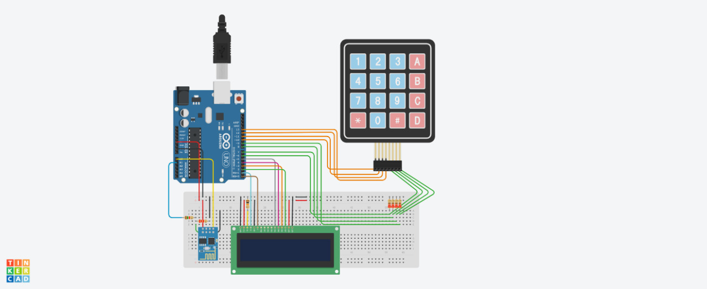

# Eleições Arduino BlockChain
Sistema de votação desenvolvido em arduino e usando um middleware em python pra armazenar os votos em blockchain.


## Requerimentos
  * Python 3
  * Flask
  * pip
  * [Pybluez](https://pybluez.github.io/)
  * [Web3](https://web3py.readthedocs.io/en/stable/quickstart.html#installation)
  * [ganache-cli](https://nethereum.readthedocs.io/en/latest/ethereum-and-clients/ganache-cli/)

## Instalando

  * **Recomendado usar um ambiente virtual, como o conda.**

* Para instalar Web3
  ```
    sudo apt-get update
    sudo apt-get install python3-dev
    sudo apt-get install libevent-dev
    pip3 install --upgrade web3
    ```

* Para instalar ganache-cli
  ```
    sudo apt-get install build-essential libssl-dev
    curl -o- https://raw.githubusercontent.com/creationix/nvm/v0.33.11/install.sh | bash

    # Instalar a última versão estável do Node.js
    nvm install 10.14.1

    npm i -g ganache-cli
    ```

* Iniciando a aplicação

  * **Deve ser executado toda vez que a aplicação for reiniciada e/ou desligada.**

  * **Os comandos devem ser executado dentro do diretório API**

  ```
  $ ganache-cli
  $ python3 deploy_contract.py
  $ python3 apivotacao.py
  ```

## Protótipo Arduíno

  * Usar a biblioteca [Keypad](urna_ino/Keypad-3.1.1.zip)
  * Código fonte [urna_ino](urna_ino/urna_ino.ino)

  
